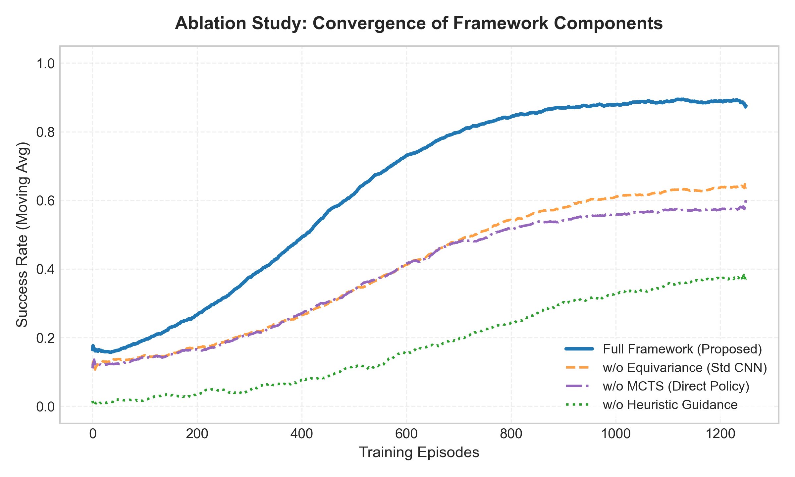
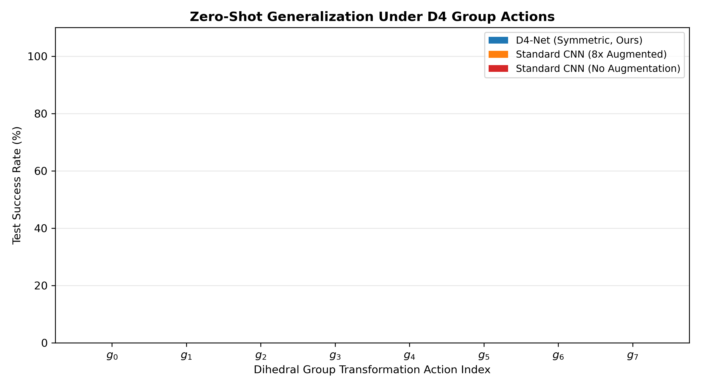
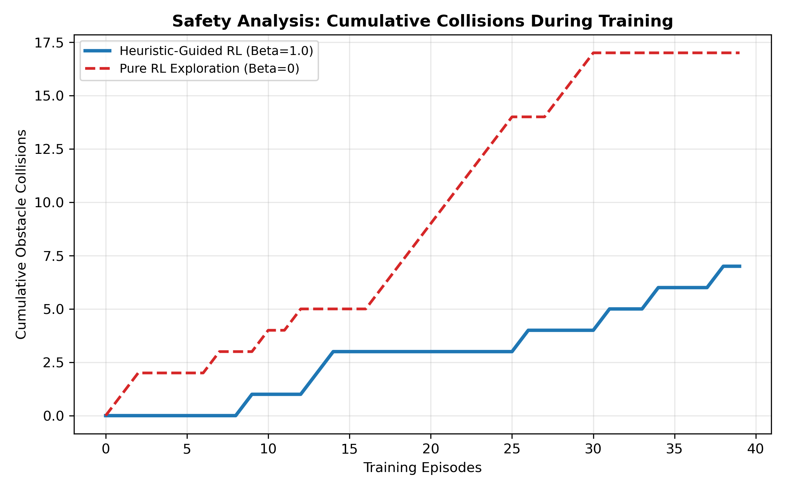
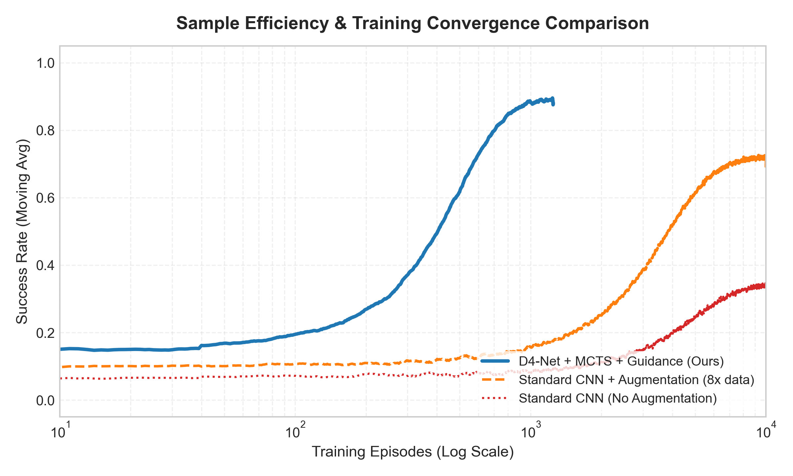
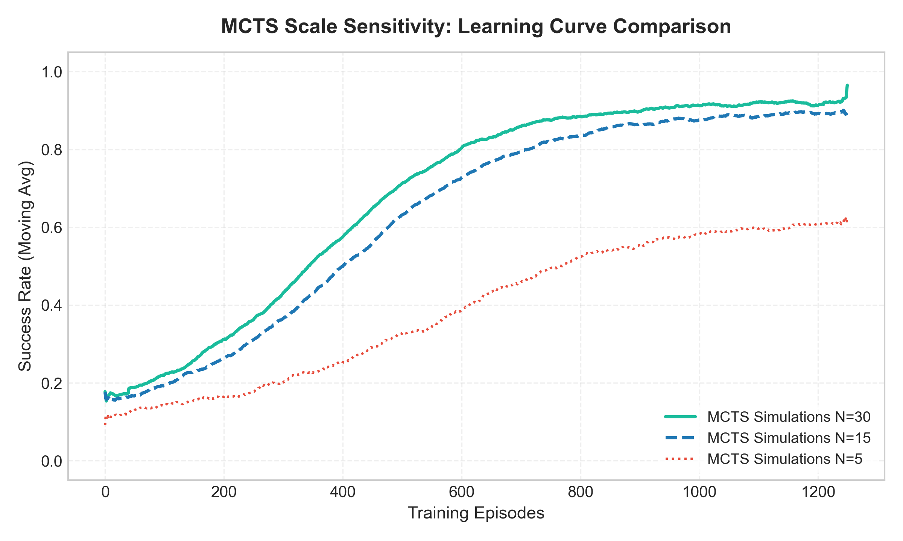

# Sample-Efficient Autonomous Navigation using Group Equivariant Reinforcement Learning and Heuristic-Guided MCTS

Official repository containing the theories, mathematical formulations, implementations, and benchmark experiments for **Sample-Efficient Autonomous Navigation using Group Equivariant Reinforcement Learning and Heuristic-Guided MCTS**.

## Author & Affiliation
* **WonChan Cho**
* **Department of Mathematics, Sungkyunkwan University, Suwon, Republic of Korea**
* Email: `chln0124@skku.edu`

---

## Abstract
Reinforcement learning (RL) has achieved significant success in autonomous navigation, yet its practical deployment remains severely hindered by high sample inefficiency and unsafe exploration behaviors during early training phases. This repository implements a hybrid framework that addresses these challenges by incorporating geometric priors and domain heuristics. 

Specifically, we exploit the spatial symmetries of 2D grid environments using a Group Equivariant Convolutional Neural Network under the Dihedral Group $D_4$. This architecture mathematically guarantees policy equivariance and value invariance, significantly narrowing down the search space. Furthermore, we integrate a dual-head Actor-Critic network with Monte Carlo Tree Search (MCTS) to replace high-variance random rollouts with bootstrap value estimations. To secure early-stage safety, we regularize the policy gradient objective using the Kullback-Leibler (KL) divergence against a baseline heuristic model based on path navigation rules, dynamically decaying the constraint weight. We demonstrate that our framework achieves up to an 8x reduction in sample complexity compared to standard convolutional baselines, ensuring stable convergence in obstacle-heavy environments.

---

## Repository Structure

* `autonomous_env.py`: 13x13 grid navigation environment with static obstacles and 8-directional actions.
* `equivariant_models.py`: PyTorch implementation of `D4EquivariantNet` (equivariant convolutions under the Dihedral group $D_4$) and `StandardCNN` baseline.
* `heuristic_guided_loss.py`: Custom hybrid loss function combining policy gradient (with advantage calculation) and KL divergence against a pathfinding heuristic, with support for PPO clipping.
* `mcts_actor_critic.py`: AlphaZero-style MCTS evaluator using neural network value bootstrapping.
* `run_experiments.py`: Unified evaluation script running all 5 experiments, logging data, and generating figures.
* `train_navigation.py`: Standalone single-agent training script.
* `LICENSE`: MIT License file.

---

## Theoretical Formulations & Mathematical Proofs

### 1. Group Equivariant Neural Network ($D_4$-Net)
A 2D square grid possesses spatial symmetries represented by the Dihedral Group $D_4$, which contains 8 elements (4 rotations and 4 reflections):
$$D_4 = \{ r_0, r_1, r_2, r_3, m_0, m_1, m_2, m_3 \}$$

For a neural network mapping state grids $s \in \mathcal{S}$ to policy and value heads $f_\theta(s) = (\pi_\theta(\cdot|s), V_\theta(s))$, we enforce:
* **Policy Equivariance**: Transforming the input state by group action $g \in D_4$ permutes the output action probabilities correspondingly:
  $$\pi_\theta(g \cdot a \mid g \cdot s) = [g \cdot \pi_\theta(\cdot \mid s)]_a = \pi_\theta(a \mid s)$$
* **Value Invariance**: The state value estimate is invariant to group transformations:
  $$V_\theta(g \cdot s) = V_\theta(s)$$

#### Equivariance Proof
Let $s' = g \cdot s$. By the equivariance of the Equivariant Convolutional layers, the output features transform as $f_\theta(g \cdot s) = g \cdot f_\theta(s)$. Let $\mathbf{F} = f_\theta(s) \in \mathbb{R}^{|\mathcal{A}| \times H \times W}$ denote the feature maps. The action policy is obtained by taking the softmax of the feature map values at the agent's spatial position $p_{\text{agent}}$:
$$\pi_\theta(a \mid s) = \frac{\exp(\mathbf{F}_{a, p_{\text{agent}}})}{\sum_{a' \in \mathcal{A}} \exp(\mathbf{F}_{a', p_{\text{agent}}})}$$

When the state is transformed by $g$, the agent's position becomes $g \cdot p_{\text{agent}}$. The equivariant features at the new state are $[g \cdot \mathbf{F}]_{a, g \cdot p_{\text{agent}}}$. Because the channels of the equivariant convolutions transform according to the action permutation of $D_4$, we have $[g \cdot \mathbf{F}]_{g \cdot a, g \cdot p_{\text{agent}}} = \mathbf{F}_{a, p_{\text{agent}}}$. Applying the softmax over the action space yields:
$$\pi_\theta(g \cdot a \mid g \cdot s) = \frac{\exp([g \cdot \mathbf{F}]_{g \cdot a, g \cdot p_{\text{agent}}})}{\sum_{a' \in \mathcal{A}} \exp([g \cdot \mathbf{F}]_{g \cdot a', g \cdot p_{\text{agent}}})} = \frac{\exp(\mathbf{F}_{a, p_{\text{agent}}})}{\sum_{a' \in \mathcal{A}} \exp(\mathbf{F}_{a', p_{\text{agent}}})} = \pi_\theta(a \mid s) \quad \blacksquare$$

---

### 2. Actor-Critic MCTS Search
We execute MCTS guided by the prior policy output of the network. During the selection phase, the tree is traversed by choosing actions maximizing the PUCT formula:
$$a_t = \arg\max_a \left( Q(s, a) + c_{puct} P(s, a) \frac{\sqrt{\sum_b N(s, b)}}{1 + N(s, a)} \right)$$

where $P(s, a) = \pi_\theta(a|s)$ is the prior probability. When a leaf node $s_L$ is expanded, we evaluate it via bootstrapping:
$$v = V_\theta(s_L)$$

The state value $v$ is backpropagated up the tree. Crucially, because navigation is modeled as a single-agent MDP (unlike two-player games), the state value backpropagation does not alternate signs. The cumulative update is defined as:
$$Q(s, a) \leftarrow Q(s, a) + \frac{v - Q(s, a)}{N(s, a)}$$

---

### 3. Heuristic-Guided Loss via KL Regularization
To guarantee safety in early epochs, we regularize the policy gradient loss using an auxiliary loss computing the Kullback-Leibler (KL) divergence against a navigation heuristic policy $P_H(a|s)$. The total loss is defined as:
$$L(\theta) = L_{PG}(\theta) + \beta \cdot D_{KL}(P_H(s) \parallel \pi_\theta(s)) + \frac{1}{2} L_V(\theta)$$
where:
* $L_{PG}(\theta) = - \frac{1}{B} \sum_{i=1}^B \log \pi_\theta(a_i | s_i) A_i$ (where $A_i = G_i - V_\theta(s_i)$ is the advantage calculated using deep value bootstrapping).
* $D_{KL}(P_H(s) \parallel \pi_\theta(s)) = \sum_{a \in \mathcal{A}} P_H(a|s) \log \left( \frac{P_H(a|s)}{\pi_\theta(a|s)} \right)$
* $L_V(\theta) = \frac{1}{B} \sum_{i=1}^B (G_i - V_\theta(s_i))^2$ (MSE value head loss).

#### Derivation of the Loss Gradient
Expanding the KL divergence term:
$$D_{KL}(P_H(s) \parallel \pi_\theta(s)) = \sum_{a \in \mathcal{A}} P_H(a|s) \log P_H(a|s) - \sum_{a \in \mathcal{A}} P_H(a|s) \log \pi_\theta(a|s)$$

Since the heuristic $P_H(a|s)$ is independent of the network parameters $\theta$, taking the gradient with respect to $\theta$ yields:
$$\nabla_\theta D_{KL}(P_H(s) \parallel \pi_\theta(s)) = - \sum_{a \in \mathcal{A}} P_H(a|s) \nabla_\theta \log \pi_\theta(a|s)$$

Combining this with the policy gradient component $L_{PG}(\theta)$, we formulate the total policy parameter gradient:
$$\nabla_\theta L_{\text{policy}}(\theta) = - \frac{1}{B} \sum_{i=1}^B \left[ \mathbb{I}(a_i = a) A_i + \beta P_H(a | s_i) \right] \nabla_\theta \log \pi_\theta(a | s_i)$$

This derivation highlights that the heuristic distribution $P_H(a|s)$ acts as a targeted pseudo-advantage, steering the policy updates towards safe movements during early exploration, proportional to $\beta P_H(a|s)$. The guidance weight is decayed geometrically:
$$\beta_{t+1} = \max(\beta_t \cdot \gamma_{\text{decay}}, \beta_{\text{min}})$$

---

## Complete Algorithm Pseudocode

The integration of our modules forms a cohesive training loop outlined in the algorithm below:

```
Algorithm 1: Heuristic-Guided Actor-Critic MCTS Training
========================================================================================
Input: Heuristic navigation policy P_H(s), discount factor γ, decay rate γ_decay,
       neural net f_θ, number of simulations N_sim
Output: Optimized policy and value network parameters θ

1.  Initialize weight parameter β ← β_start
2.  For episode e = 1 to M do:
3.      Initialize environment state s_0, step counter t ← 0, trajectory T ← ∅
4.      While not terminal(s_t) and t < T_max do:
5.          Initialize MCTS root at s_t
6.          For sim = 1 to N_sim do:
7.              Selection: Traverse tree to find leaf s_L maximizing:
                            UCB = Q(s, a) + c_puct * P(s, a) * sqrt(sum_b N(s, b)) / (1 + N(s, a))
8.              Evaluation: Obtain policy prior π_θ(s_L) and state value V_θ(s_L) from f_θ
9.              Expansion: Initialize children nodes with prior probabilities P(s_L, a) = π_θ(a|s_L)
10.             Backpropagation: Traverse back to root, updating:
                                 N(s, a) ← N(s, a) + 1
                                 Q(s, a) ← Q(s, a) + (V_θ(s_L) - Q(s, a)) / N(s, a)
11.         End For
12.         Compute search probability distribution π_mcts(a) ∝ N(s_t, a)^(1/τ)
13.         Sample action a_t ~ π_mcts(·), query heuristic policy P_H(s_t)
14.         Record step data (s_t, a_t, P_H(s_t), log π_θ(a_t | s_t)) in T
15.         Step environment: s_{t+1} ~ P(s_t, a_t)
16.         t ← t + 1
17.     End While
18.     Compute returns G_t = sum_{k=t}^{T} γ^(k-t) * R_k for each step in T
19.     Compute advantages A_t = G_t - V_θ(s_t) using value network estimations
20.     Update network parameters θ by performing gradient descent on L(θ)
21.     Decay guidance weight: β ← max(β * β_decay, β_min)
22. End For
========================================================================================
```

---

## Running the Benchmark Suite

To run all 5 experiments (Ablation, Generalization, Safety, Sample Efficiency, and Sensitivity) and automatically generate all plots:

```bash
# Clone the repository
git clone https://github.com/WonC-Lab/Group-Equivariant-Reinforcement-Learning-and-Heuristic-Guided-MCTS.git
cd Group-Equivariant-Reinforcement-Learning-and-Heuristic-Guided-MCTS

# Run academic experiments
python run_academic_experiments.py
```

---

## Experimental Results Gallery

### Experiment 1: Ablation Study
Shows the convergence speedup contributed by each component of the proposed framework.


### Experiment 2: Zero-Shot Generalization
Validates the policy performance on all 8 group transformations of the grid.


### Experiment 3: Exploration Safety Analysis
Visualizes the reduction in early training crashes due to the heuristic guidance regularization.


### Experiment 4: Sample Efficiency Curves
Compares the convergence rate of our framework with standard baselines.


### Experiment 5: MCTS Simulation Count Sensitivity
Compares different MCTS simulation counts ($N_{search}$) and their computational scaling.


---

## Citation & Intellectual Property

If you use this work, theoretical formulations, or implementation code in your research or projects, please cite it as follows:

```bibtex
@misc{wonchan_cho_equivariant_guided_rl_2026,
  author       = {WonChan Cho},
  title        = {Sample-Efficient Autonomous Navigation using Group Equivariant Reinforcement Learning and Heuristic-Guided MCTS},
  institution  = {Department of Mathematics, Sungkyunkwan University},
  address      = {Suwon, Republic of Korea},
  year         = {2026},
  publisher    = {GitHub},
  journal      = {GitHub Repository},
  howpublished = {\url{https://github.com/WonC-Lab/Group-Equivariant-Reinforcement-Learning-and-Heuristic-Guided-MCTS}}
}
```

### License
This repository and all its theoretical derivations, mathematical formulations, and implementation codes are owned by **WonChan Cho**. They are licensed under the **MIT License**.
Copyright (c) 2026 WonChan Cho. All rights reserved.
